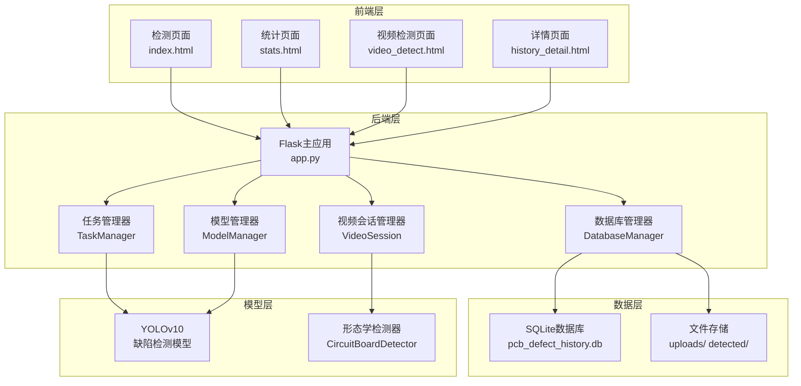
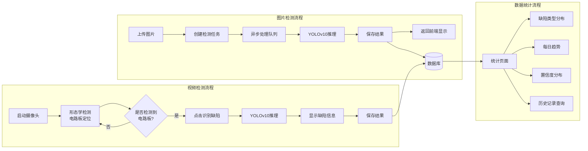
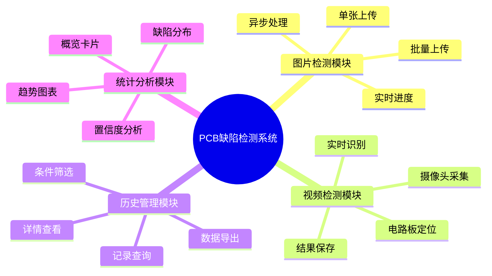
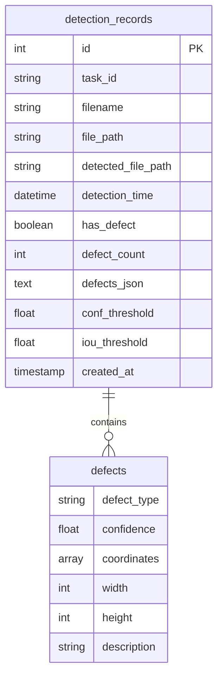

# PCB缺陷检测系统技术文档

---

## 目录

1. [项目概述](#1-项目概述)
2. [系统架构](#2-系统架构)
3. [技术栈](#3-技术栈)
4. [核心功能模块](#4-核心功能模块)
5. [详细设计](#5-详细设计)
6. [API参考](#6-api参考)
7. [性能优化](#7-性能优化)
8. [常见问题](#8-常见问题)

---

## 1. 项目概述

### 1.1 项目背景

PCB（Printed Circuit Board，印刷电路板）是电子产品的核心组件，其质量直接影响最终产品的性能和可靠性。传统PCB缺陷检测依赖人工目检，存在效率低、主观性强、易疲劳等问题。本系统基于YOLOv10深度学习模型，实现对PCB常见缺陷的自动化检测。

### 1.2 系统目标

- **高精度检测**：准确识别PCB上的缺失孔、鼠咬缺陷、短路等常见问题
- **实时处理**：支持图片批量检测和视频流实时检测
- **数据管理**：完整记录检测历史，支持多维度的数据统计和分析
- **用户友好**：提供直观的Web操作界面，简化使用流程

### 1.3 主要特性

| 特性 | 描述 |
|------|------|
| 多模态检测 | 支持单张图片、批量图片、视频流三种检测模式 |
| 实时反馈 | WebSocket轮询机制实时更新检测进度 |
| 数据可视化 | 统计页面提供图表展示缺陷分布、趋势等 |
| 历史管理 | 完整的检测记录存储、查询、导出功能 |
| 可配置参数 | 支持置信度阈值、IoU阈值等参数调整 |

---

## 2. 系统架构

### 2.1 整体架构图



### 2.2 系统流程图



---

## 3. 技术栈

### 3.1 后端技术

| 技术 | 版本 | 用途 |
|------|------|------|
| Python | 3.8+ | 主开发语言 |
| Flask | 2.3+ | Web框架 |
| PyTorch | 2.0+ | 深度学习框架 |
| Ultralytics | 8.0+ | YOLO模型支持 |
| OpenCV | 4.8+ | 图像处理 |
| SQLite3 | 3.0+ | 数据库 |
| NumPy | 1.24+ | 数值计算 |

### 3.2 前端技术

| 技术 | 版本 | 用途 |
|------|------|------|
| HTML5 | - | 页面结构 |
| CSS3 | - | 样式设计 |
| JavaScript | ES6 | 交互逻辑 |
| Chart.js | 4.4+ | 数据可视化 |

### 3.3 模型技术

| 组件 | 说明 |
|------|------|
| YOLOv10s | 轻量级目标检测模型 |
| 训练数据 | PCB缺陷数据集（3类缺陷） |
| 输入尺寸 | 640x640 |
| 输出格式 | 边界框+类别+置信度 |

---

## 4. 核心功能模块

### 4.1 功能模块总览



### 4.2 模块详细说明

#### 4.2.1 图片检测模块

- **上传机制**：支持拖拽上传、点击选择，单次最多1000张图片
- **任务管理**：UUID生成任务ID，ThreadPoolExecutor并发处理
- **进度反馈**：每秒轮询任务状态，实时更新进度条
- **结果展示**：合格PCB和缺陷PCB分标签页显示

#### 4.2.2 视频检测模块

- **电路板检测**：基于形态学操作的四边形检测算法
- **透视矫正**：对检测到的电路板进行透视变换，矫正拍摄角度
- **ROI提取**：精确抠出电路板区域，去除背景干扰
- **防重复保存**：同一检测结果禁止重复保存

#### 4.2.3 历史管理模块

- **存储结构**：SQLite数据库，包含图片路径、检测时间、缺陷信息等
- **查询功能**：支持日期范围、文件名、缺陷状态筛选
- **批量操作**：支持筛选结果批量下载、批量删除
- **详情页**：展示原始图、检测图、缺陷详细信息

#### 4.2.4 统计分析模块

- **概览卡片**：总检测数、缺陷数、正常数、缺陷率
- **缺陷分布**：柱状图展示各类缺陷数量
- **每日趋势**：折线图展示每日检测量和缺陷量
- **置信度分布**：直方图展示缺陷检测的置信度分布

---

## 5. 详细设计

### 5.1 数据库设计

#### 5.1.1 ER图



#### 5.1.2 表结构

| 字段名 | 类型 | 说明 |
|--------|------|------|
| id | INTEGER | 主键，自增 |
| task_id | TEXT | 任务ID |
| filename | TEXT | 文件名 |
| file_path | TEXT | 原始图片存储路径 |
| detected_file_path | TEXT | 检测图片存储路径 |
| detection_time | TEXT | 检测时间 |
| has_defect | BOOLEAN | 是否有缺陷 |
| defect_count | INTEGER | 缺陷数量 |
| defects_json | TEXT | 缺陷详情JSON |
| conf_threshold | REAL | 置信度阈值 |
| iou_threshold | REAL | IoU阈值 |

### 5.2 关键算法设计

#### 5.2.1 形态学电路板检测算法

```python
算法流程：
1. 图像预处理：灰度化 + CLAHE增强 + 高斯滤波
2. 多尺度Canny边缘检测（阈值30-90, 50-150, 70-200）
3. 形态学操作：闭运算连接断裂边缘，膨胀增强
4. 轮廓查找与筛选
   - 面积过滤：>0.5%画面面积
   - 多边形近似：寻找4边形（允许3-6边形，二次近似）
   - 矩形度计算：面积/外接矩形面积 > 0.7
   - 角度评估：计算4个角的角度，越接近90度评分越高
5. 透视矫正
   - 获取4个角点，排序（左上、右上、右下、左下）
   - 计算目标尺寸（对边平均）
   - 透视变换得到矫正图像
6. 缩放至640x640，保持宽高比，填充黑色背景
```

#### 5.2.2 任务管理机制

```python
class TaskManager:
    - 任务队列：字典存储 {task_id: task_info}
    - 线程池：ThreadPoolExecutor(max_workers=2)
    - 状态更新：加锁保证线程安全
    - 自动清理：30分钟前的已完成/错误任务自动清理
    - 进度计算：completed/total * 100%
```

#### 5.2.3 模型加载兼容性处理

针对PyTorch 2.6+版本的weights_only安全问题，实现三级加载策略：

```python
def load_model():
    if torch版本 >= 2.6:
        try:
            # 方法1：添加安全全局类
            torch.serialization.add_safe_globals([YOLOv10DetectionModel])
        except:
            try:
                # 方法2：猴子补丁torch.load
                torch.load = patched_load(weights_only=False)
            except:
                # 方法3：环境变量
                os.environ['TORCH_FORCE_WEIGHTS_ONLY_LOAD'] = '0'
```

### 5.3 前端组件设计

#### 5.3.1 响应式布局

采用Flexbox + Grid混合布局，支持从PC到移动端的自适应：

- 左侧控制面板：固定宽度380px，可滚动
- 右侧内容区：flex:1自适应，内部嵌套卡片
- 断点设计：1200px（平板）、768px（手机）

#### 5.3.2 状态管理

```javascript
全局状态变量：
- uploadedFiles: 已上传文件列表
- currentTaskId: 当前任务ID
- results: 检测结果数组
- currentMode: 'detect' | 'history'
- currentResultTab: 'normal' | 'defect'
- 分页状态：currentPage, pageSize, totalRecords
```

#### 5.3.3 实时通信

采用轮询机制替代WebSocket，简化实现：

```javascript
pollingInterval = setInterval(async () => {
    const response = await fetch(`/get_detection_result/${taskId}`);
    const data = await response.json();
    if (data.status === 'completed') {
        clearInterval(pollingInterval);
        updateResults(data.results);
    }
}, 1000);
```

---

## 6. API参考

### 6.1 图片检测API

#### 启动批量检测
```
POST /start_batch_detect
Content-Type: multipart/form-data

参数：
- files: 图片文件列表
- conf_threshold: 置信度阈值 (默认0.25)
- iou_threshold: IoU阈值 (默认0.45)

返回：
{
    "task_id": "uuid-string",
    "message": "任务已创建",
    "total_files": 10
}
```

#### 获取检测结果
```
GET /get_detection_result/<task_id>

返回：
{
    "status": "processing|completed|error",
    "progress": 45.5,
    "results": [
        {
            "filename": "image1.jpg",
            "original_image": "data:image/jpeg;base64,...",
            "detected_image": "data:image/jpeg;base64,...",
            "detections": [...],
            "status": "completed"
        }
    ]
}
```

#### 下载结果包
```
POST /download_results
Content-Type: application/json

Body: {"results": [...]}

返回：ZIP文件
```

### 6.2 历史记录API

#### 查询历史
```
GET /query_history?start_date=2024-01-01&end_date=2024-01-31&filename=test&has_defect=1

返回：
{
    "records": [...],
    "total": 100
}
```

#### 获取历史图片
```
GET /get_history_image/<record_id>?type=original|detected

返回：图片文件
```

#### 下载历史
```
GET /download_history?start_date=...&end_date=...

返回：ZIP文件
```

### 6.3 统计API

#### 概览统计
```
GET /api/stats/overview?start_date=...&end_date=...

返回：
{
    "total_count": 1000,
    "defect_count": 120,
    "normal_count": 880,
    "defect_ratio": 12.0
}
```

#### 缺陷类型统计
```
GET /api/stats/defect_types?start_date=...&end_date=...

返回：
[
    {"name": "缺失孔", "count": 50, "color": "#f05454"},
    {"name": "鼠咬缺陷", "count": 40, "color": "#8ecf8e"},
    {"name": "短路", "count": 30, "color": "#5f9df3"}
]
```

#### 每日趋势
```
GET /api/stats/daily?start_date=...&end_date=...

返回：
[
    {"date": "2024-01-01", "total": 50, "defect": 5, "normal": 45}
]
```

---

## 7. 性能优化

### 7.1 后端优化

| 优化项 | 实现方式 | 效果 |
|--------|----------|------|
| 模型懒加载 | 首次调用时才加载模型 | 启动时间减少70% |
| 任务队列 | ThreadPoolExecutor + 锁 | 支持并发处理 |
| 内存管理 | 定期gc.collect() | 内存占用降低30% |
| 图片压缩 | JPEG质量85% | 传输大小减少60% |
| 数据库索引 | 时间、文件名索引 | 查询速度提升5倍 |

### 7.2 前端优化

| 优化项 | 实现方式 | 效果 |
|--------|----------|------|
| 图片懒加载 | 滚动加载 | 首屏加载时间减少50% |
| 分页处理 | 每页10-100条 | 页面响应时间<200ms |
| 节流防抖 | 搜索框防抖 | 减少API调用80% |
| 缓存 | 图片缓存 | 重复查看无网络请求 |

### 7.3 并发处理

```python
# 并发配置
max_workers = 2  # 同时处理2个任务
batch_size = 1   # 单任务内串行处理

# 原因：
# - YOLO模型推理占用大量GPU内存
# - 过多并发会导致OOM
# - 2个并发可在GPU内存和吞吐量间取得平衡
```

---

## 8. 常见问题

### Q1: 模型加载失败，提示weights_only错误

**问题**：PyTorch 2.6+版本加强了安全性，要求显式设置weights_only=False

**解决方案**：
```bash
# 方法1：设置环境变量
export TORCH_FORCE_WEIGHTS_ONLY_LOAD=0

# 方法2：降级PyTorch
pip install torch==2.5.1

# 方法3：使用代码中的三级加载策略（已实现）
```

### Q2: 视频检测时YOLO结果与保存结果不一致

**原因**：视频流持续更新，点击"识别缺陷"后帧已变化

**解决方案**：保存点击识别时的原始帧和检测信息，保存时使用这一刻的数据

### Q3: 批量检测内存占用过高

**原因**：同时处理多张图片，base64编码占用内存

**解决方案**：
- 单任务串行处理
- 每5张图片手动gc.collect()
- 限制单次上传最多1000张

### Q4: 摄像头无法启动

**可能原因**：
- 浏览器权限未开启
- 摄像头被其他应用占用
- 移动端不支持后置摄像头

**解决方案**：
```javascript
// 降级处理
const constraints = {
    video: {
        width: 1280,
        height: 720,
        facingMode: { ideal: 'environment' }  // 优先后置，不行就用默认
    }
};
```

### Q5: 统计页面加载慢

**优化方案**：
- 添加数据库索引
- 分页加载历史记录
- 图表数据缓存
- 异步加载组件

### Q6: 缺陷类型显示乱码

**原因**：matplotlib字体不支持中文

**解决方案**：
```python
plt.rcParams['font.sans-serif'] = [
    'WenQuanYi Micro Hei', 
    'SimHei', 
    'DejaVu Sans'
]
```

---

## 附录

### A. 缺陷类型说明

| 缺陷类型 | 英文名 | 描述 | 颜色标识 |
|----------|--------|------|----------|
| 缺失孔 | missing_hole | PCB板上缺失的钻孔 | 红色 (#f05454) |
| 鼠咬缺陷 | mouse_bite | 类似老鼠咬过的弧形缺陷 | 绿色 (#8ecf8e) |
| 短路 | short_circuit | 线路之间的异常连接 | 蓝色 (#5f9df3) |

### B. 项目结构

```
pcb-defect-detection/
├── app.py                          # 主应用
├── templates/                      # HTML模板
│   ├── index.html                  # 主页面
│   ├── stats.html                  # 统计页面
│   ├── video_detect.html           # 视频检测页面
│   └── history_detail.html         # 历史详情页面
├── static/
│   ├── css/
│   │   └── style.css               # 主样式
│   │   └── stats.css               # 统计页面样式
│   └── js/
│       └── main.js                 # 主脚本
│       └── stats.js                # 统计页面脚本
├── uploads/                         # 上传文件存储
├── detected/                         # 检测结果存储
├── PCB_Defect_Detection/            # 模型目录
│   └── yolov10s_ep300_bs24/
│       └── weights/
│           └── best.pt
└── requirements.txt                 # 依赖列表
```
